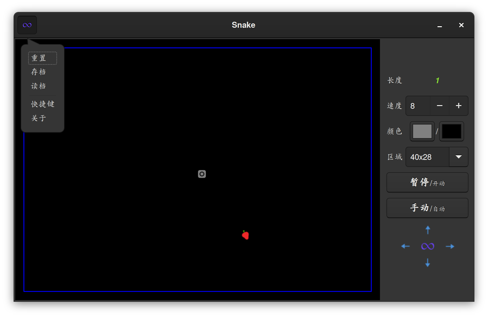
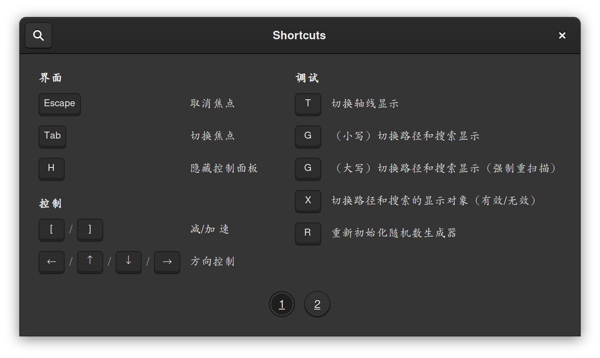
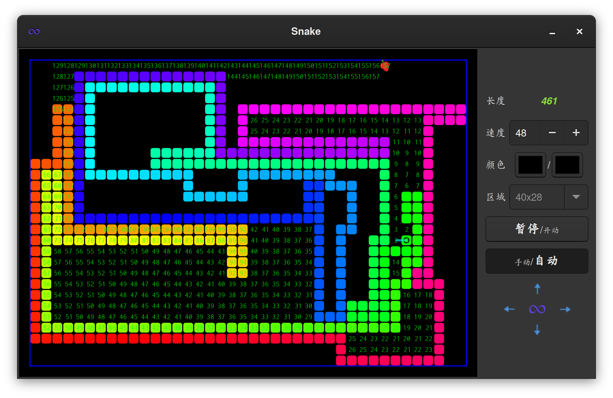
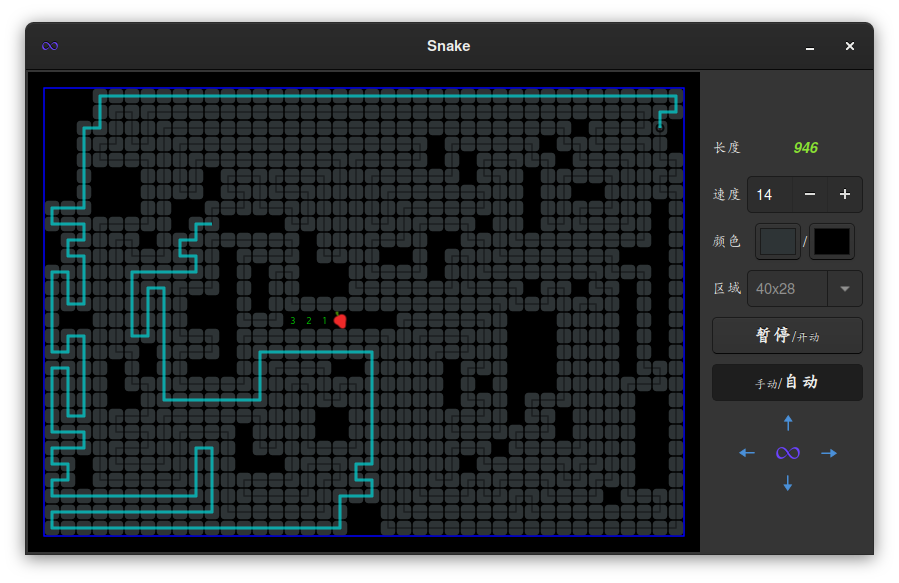

= 贪吃蛇

== 关于

游戏界面使用 GTK，主要实现：

--
. 存档/读档
. 手动模式
. 自动模式
.. 随机移动
.. 贪婪模式
.. 理性模式
--

运行模式中手动/自动可随时自由切换。UI 界面配合 cairo 绘图，可以方便使用快捷键显示搜索状态及路径信息

游戏存在一个终极状态：cycle of life (COL)，此时贪吃蛇吃掉了最后一份食物，占据整个可移动窗口，
头部紧跟尾巴走，永久循环，生生不息。

遗憾的是，目前的理性策略正常无法让小蛇走到这最终阶段，最终三种情况：
--
. circle  of life ，理想情况（可惜很难达到）
. 当小蛇长到一定程度，吃掉某个食物后，COL 路径中突然生成了新的食物导致原先计算的 path_col 失效，被呛死
. 接近 COL 状态时，小蛇不规则地围住若干孤立未填充的空洞，不敢吃食物，就此循环
--

[.float-group]
.游戏截图
--

--

== 相关说明

- 自动模式说明

. 随机移动：随机选择可移动方向
. 贪婪模式：优先选择向着食物的方向移动，除非该方向无法前进
. 理性模式：BFS 搜索蛇头到食物的最短路径，并判断抵达食物后是否安全，综合决定之后的移动路径

- 理性模式策略

. 搜索抵达食物的最佳路径 (path)，及吃到食物后回到尾巴的路径(path_col)
.. 如 path 和 path_col 均存在，则出发前往食物，并缓存 path_col
.. 否则，使用备用路径（尝试缓存的 path_col, 无效则搜索 wander 路径）

- wander 路径
. 当没有合适的路径可用时，尝试折叠蛇身。在一定长度后重新搜索 path 和 path_col。
.. 左转到无可转，改右转；右转亦然。
.. 每次前进一格，但须保证每次前进后都有 path_col，否则返回路径为空

. 对于返回路径为空：随机尝试所有可移动方向（无论是否安全），即退化为随机移动

- BFS 搜索

* 数据结构
. `map_dist`, `map_aim` : numpy 二维数组，分别保存各位置到搜索起点路程，最后抵达该位置的方向向量
. `pqueue` : heapq 优先队列，应用于成本函数，实现启发式搜索

* 成本函数
. `cost = lambda pos: map_dist[pos.x, pos.y] + dxy(end-pos)` 当前路程 + 剩余最短距离（dx + dy）

* 附加限制
. 每次节点外扩时，不可回头（蛇头不能直接 180° 调转方向）
. 蛇的本体在移动，本体占据空间时，蛇头不可进入

* 找到目标后的路径回溯
. 根据 `map_aim` 信息，从目标回溯至起始位置

== 部分实现

类对象::
--
. `Snake` 贪吃蛇本体，基本移动、检查及策略

    self.graph          抵达食物的搜索地图
    self.graph_col      抵达尾部的搜索地图
    self.path           后续移动路径
    self.path_col       抵达尾部的路径
    self.path_unsafe    缓存到达食物后找不到尾巴的路径

. `SnakeApp` 界面，绘图及交互操作
--

相关检查::
--
. `is_full(self)` 长度是否已填满整个游戏区域
. `is_died(self)` 死去还是活着
. `is_inside(self, point)` 座标是否在游戏区域内部
. `is_aim_valid(self, aim)` 前进方向是否有效
--

移动与更新::
--
. `get_auto_aim(self, mode, md_sub=True)` 根据运行模式，获取下一步可移动方向
. `update_path_and_graph(self)` 检查及更新路径和搜索状态
. `timer_move(self, data)`, `check_and_update_after_move(self)` snakeapp 移动和移动后检查更新调用
--

搜索实现::
--
. `BFS(self, graph, start=None, end=None)` A* 广度优先搜索
. `scan_wrapper(self, body=None, aim=None, target=None)` BFS 搜索操作预处理及打包
. `body_rect_with_border(self, body, food=None)` 获取包围 body 最小矩形，并外扩一周，作为 bfs 搜索边界
--

路径搜索::
--
. `scan_path_and_graph(self, body=None, aim=None)` 搜索蛇头到食物的有效路径
. `scan_cycle_of_life(self, body=None, aim=None)` 搜索蛇头到尾部的有效路径，用于确定吃食物是否安全
. `get_path_col_with_adj(self, body=None)` 发现不安全路径后，寻找备用路径（优先 path_col，其次 wander）
. `adjust_path_on_unsafe(self, path, path_unsafe, body)` 根据 path_unsafe 调整当前 path，避免不必要检查
--

cairo 绘图::
--
. `deaw_init(self, dp)` 绘制初始窗口
. `draw_snake(self, dp)` 绘制 snake 本体，调用绘制躯体轴线，路径等
. `draw_snake_trace(self, dp)` 显示 snake 躯体轴线，方便寻迹
. `draw_snake_path(self, dp, path)` 显示后续移动路径
. `draw_snake_graph_with_*(selfp, dp, graph)` 显示路径及搜索状态
. `draw_gameover(self, dp)` gameover 温馨提示
--

== 部分知识点
. 算法：A* 搜索
. 数学：线性变换，向量计算
. 界面: gtk, cairo
